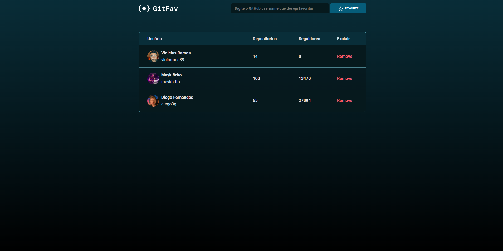

# GitFav

Esse projeto basicamente é para você favoritar pessoas do GitHub, para facilitar o acesso ao perfil e seus repositórios, um projeto baseado no Stage 06, do curso Explorer da rocketseat.

  

## Conceitos utilizados

- 🚀 Assincronismo;
- 🚀 Tabelas no HTML;
- 🚀 Screen Reader Only;
- 🚀 Imutabilidade;
- 🚀 Método filter();
- 🚀 localStorage;
- 🚀 API do github;
- 🚀 Desestruturação no JavaScript;
- 🚀 Async functions;
- 🚀 Try, catch e throw;

## 🔗 Links

## 🚀 Tecnologias

Esse projeto foi desenvolvido com as seguintes tecnologias:

- HTML e CSS
- JavaScript 
- Git e Github
